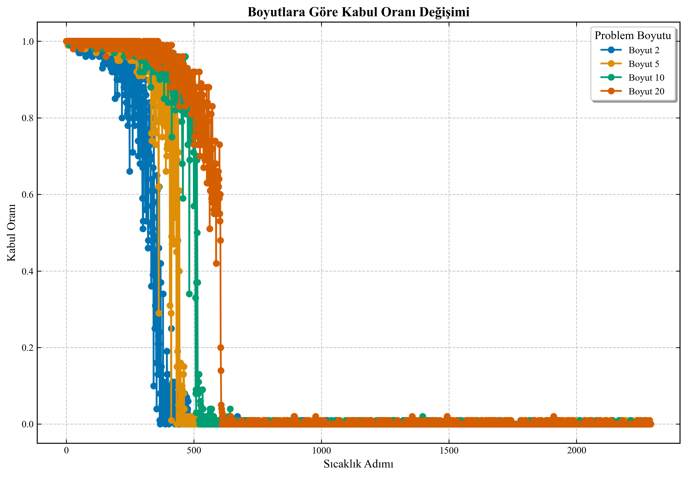

# Ackley Function Optimization

This folder contains a case study on the optimization of the Ackley function using the Simulated Annealing algorithm.

## Contents

- `ackley_optimization.py`: Python implementation of the optimization algorithm
- `pseudo.txt`: Annotated pseudocode of the Simulated Annealing algorithm
- `visualizations/`: Visualization of the optimization process in different dimensions

## Ackley Function

The Ackley function is a multi-dimensional test function with many local minima. Its global minimum is at the point (x,y,z,...) = (0,0,0,...) with a value of 0. This function is frequently used to test the ability of optimization algorithms to find the global minimum without getting trapped in local minima.

Function equation:
```
f(x) = -20 * exp(-0.2 * sqrt(1/d * sum(x_i^2))) - exp(1/d * sum(cos(2π*x_i))) + 20 + e
```

## Simulated Annealing Algorithm

Simulated Annealing is an optimization algorithm inspired by the annealing process of metals. When metals are heated and then slowly cooled, atoms arrange themselves in a more orderly manner, reaching lower energy states. Similarly, in this algorithm, we control the system with a parameter called "temperature."

Basic principles of the algorithm:
1. At high temperatures, large steps are taken, and even poor solutions are accepted with high probability
2. As the temperature decreases, step size decreases, and the probability of accepting poor solutions drops
3. At low temperatures, the algorithm behaves similar to a local search

## Analyses Performed

The following analyses were performed in this example:

1. Ackley function optimization in different dimensions (2, 5, 10, 20)
2. Convergence, step size, acceptance ratio, and temperature analyses for each dimension
3. Visualization of the solution path on the function contour plot for the 2-dimensional case

## Visualizations

The graphics in the `visualizations/` folder include:

- `convergence_dim_X.png`: Convergence analysis for X-dimensional problem
- `step_size_acceptance_dim_X.png`: Step size and acceptance ratio changes for X-dimensional problem
- `temperature_energy_dim_X.png`: Temperature and energy changes for X-dimensional problem
- `ackley_contour_2d.png`: 2D Ackley function contour plot and solution path
- `dimension_analysis.png`: Comparative analysis of different dimensions
- `energy_history_all_dims.png`: Energy change graphs for all dimensions
- `acceptance_ratio_all_dims.png`: Acceptance ratio graphs for all dimensions

### Sample Visualizations:


*Figure 1: 2D Ackley function contour plot and solution path*


*Figure 2: Comparative analysis of different dimensions*


*Figure 3: Energy change graphs for all dimensions*


*Figure 4: Acceptance ratio change for all dimensions*

## How to Run

```python
python ackley_optimization.py
```

When the code is run, optimization processes in different dimensions are performed, and the results are saved to the `visualizations/` folder.

## Important Parameters

- `initial_temp`: Initial temperature (100.0)
- `min_temp`: Minimum temperature (10^-8)
- `cooling_rate`: Cooling rate (0.99)
- `iterations_per_temp`: Number of iterations per temperature (100)
- `bounds`: Ackley function bounds (-32.768, 32.768)

## Results and Comments

### Dimension Effect
As seen from the visualizations, optimization becomes more difficult as the problem dimension increases. While optimization converges relatively quickly in 2 dimensions, it takes longer and converges less closely to the global optimum in 20 dimensions. This demonstrates the problem known as the "curse of dimensionality."

### Temperature and Step Size Relationship
As shown in the graphs, step size decreases as temperature drops. This allows the algorithm to explore a wide area at the beginning and perform more localized searches towards the end. This approach plays a critical role in helping the algorithm avoid local minima.

### Acceptance Ratio Change
It is observed that the acceptance ratio decreases as the temperature drops. This shows that the algorithm becomes more selective during the cooling process. A high acceptance ratio at the beginning enables broad exploration of the solution space, while a low acceptance ratio at low temperatures allows fine-tuning around good solutions that have been found.

### Convergence Characteristics
Visualizing energy values on a logarithmic scale clearly shows the convergence characteristics of the algorithm. As seen from the graphs, the algorithm exhibits a rapid decrease initially, but the convergence rate decreases in later iterations. This indicates that the optimization process provides major improvements at the beginning and smaller improvements in later stages.

### 2D Contour Analysis (Figure 1)
As shown in Figure 1, the 2D contour plot displays the solution path of the algorithm. This graph shows that the algorithm initially moves randomly with large steps and then concentrates around the global minimum in later stages. This visualization is particularly useful for understanding how simulated annealing can escape from local minima.

### Comparative Analysis of Different Dimensions (Figure 2)
As shown in Figure 2, optimization performances in different dimensions are compared. This graph clearly shows that:

1. As the problem dimension increases, the algorithm's ability to converge to the global optimum decreases. While the final energy value in 2 dimensions is very close to 0, this value is significantly higher in 20 dimensions.

2. The runtime also increases with dimension. Solving a 20-dimensional problem takes approximately 10 times longer than solving a 2-dimensional problem.

3. Although the efficiency of optimization decreases as dimension increases, the algorithm can still provide certain improvements in each dimension. This shows that simulated annealing is still usable even for high-dimensional problems.

### Energy Change Analysis for All Dimensions (Figure 3)
As shown in Figure 3, the convergence behaviors of problems in different dimensions are compared on a single graph:

1. Optimization shows a rapid energy decrease initially in all dimensions, but as dimension increases, this rate of decrease slows down, and the minimum value reached increases.

2. While the algorithm can reach approximately the global minimum in 2 and 5-dimensional problems, it converges at higher energy values in 10 and 20-dimensional problems.

3. Energy values shown on a logarithmic scale dramatically reveal the effect of dimension on algorithm performance. The energy value for the 20-dimensional problem is several orders of magnitude higher than for the 2-dimensional problem.

4. Although improvement is seen in all dimensions as the number of iterations increases, this improvement occurs more slowly in higher dimensions and requires more iterations.

### Acceptance Ratio Comparison (Figure 4)
As shown in Figure 4, the acceptance ratio changes with temperature for problems of different dimensions:

1. In all dimensions, the acceptance ratio decreases as temperature decreases. This shows that the algorithm becomes more selective during the cooling process.

2. In higher dimensions (10 and 20), the acceptance ratio drops more rapidly at low temperatures. This indicates that the algorithm tends to "freeze" earlier in high-dimensional problems.

3. The change in acceptance ratio depending on dimension shows that the cooling schedule should be adjusted according to the problem dimension. A slower cooling schedule or higher initial temperature should be preferred for high-dimensional problems.

4. While a certain acceptance ratio is maintained even at low temperatures in the 2-dimensional problem, the acceptance ratio drops almost to zero in the 20-dimensional problem. This shows that the algorithm's ability to effectively explore the solution space decreases in high-dimensional problems.

### Implications for Practical Applications
These analysis results provide important clues about how the Simulated Annealing algorithm can be used in practical applications:

1. Higher dimensional problems may require longer runtimes or slower cooling rates
2. The initial temperature should be related to the step size and the size of the problem space
3. The cooling rate should be adjusted specifically for the problem - too rapid cooling increases the risk of getting stuck in local minima
4. Although the algorithm does not guarantee the global optimum, it can produce sufficiently good solutions for practical applications

## License

This project is provided as an educational resource and is free to use and modify. 