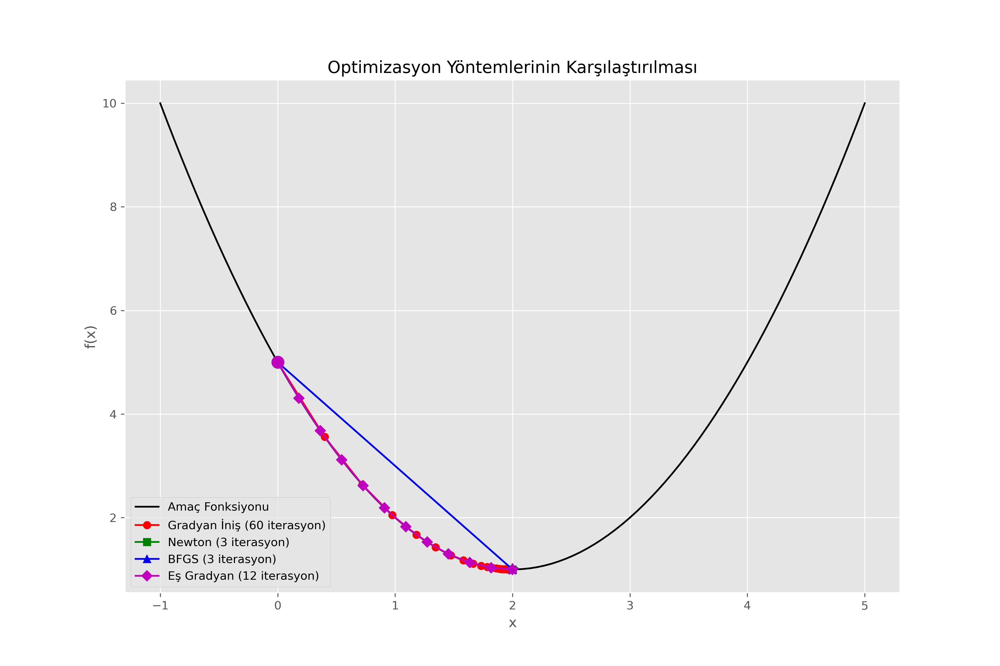
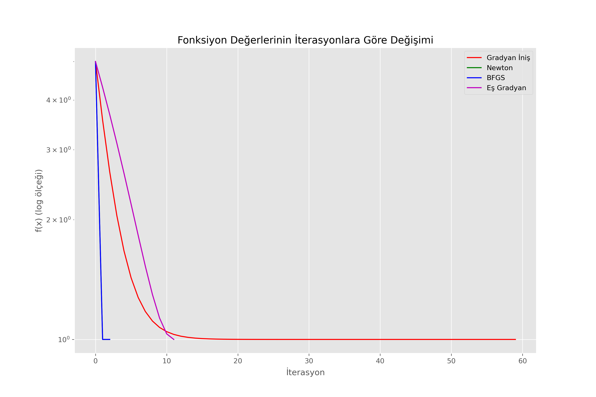
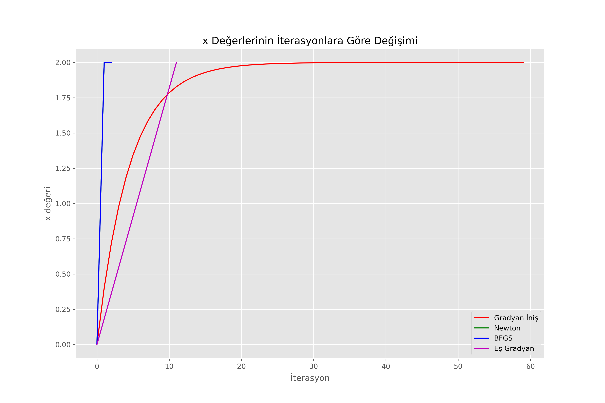

# Comparison of Optimization Methods

This project compares the performance of different optimization methods on a simple function.

## Summary

The project examines the behavior and performance of four different optimization algorithms for a single-variable optimization problem:

1. Gradient Descent Method
2. Newton's Method
3. BFGS Method (Broyden–Fletcher–Goldfarb–Shanno)
4. Conjugate Gradient Method

## Function Used

Test function used in the study: `f(x) = (x-2)^2 + 1`

This function has a minimum value of `f(2) = 1` at the point `x = 2`.

## Results



The graph above shows the paths followed by different optimization methods on the objective function. The starting point and the reached optimum point are marked for each method.



This graph shows the convergence speed of each method to the optimum function value on a logarithmic scale.



This graph shows the convergence speed of each method to the optimum `x` value on a logarithmic scale.

## Observations

- **Newton's Method**: Shows the fastest convergence as it uses second derivative information.
- **BFGS Method**: Demonstrates similar performance to Newton's method, but approximates the Hessian matrix instead of calculating it.
- **Conjugate Gradient Method**: A method that can be more efficient than Newton and BFGS by using first derivative information.
- **Gradient Descent Method**: The simplest and slowest converging method.

## Usage

To run the program:

```
python optimization_methods.py
```

## Dependencies

- NumPy
- Matplotlib
- SciPy 

## License

This project is provided as an educational resource and is free to use and modify. 