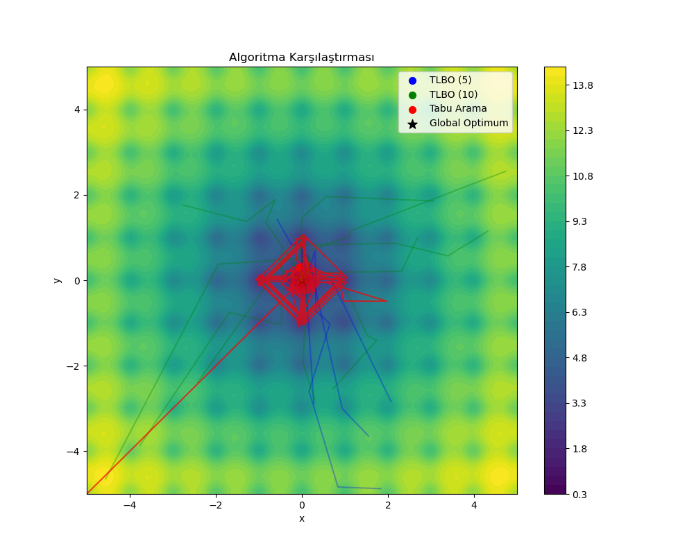
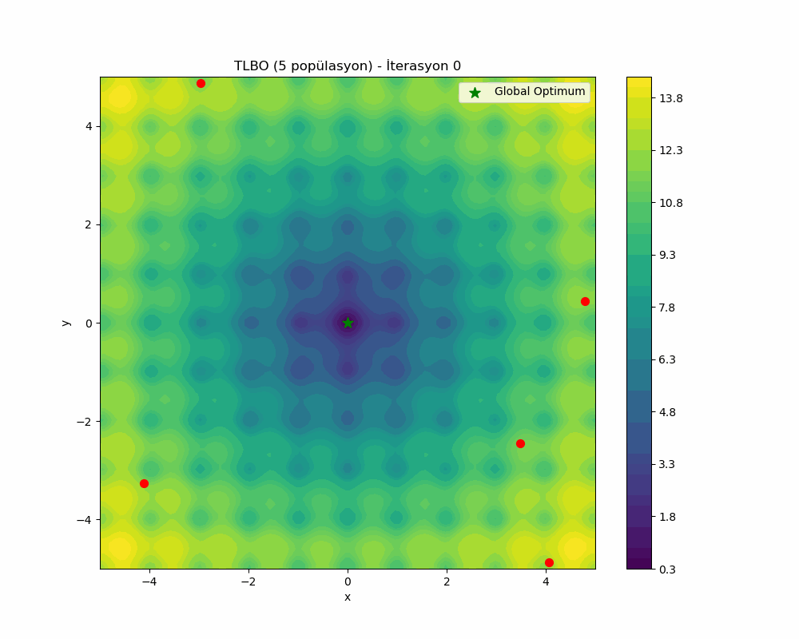
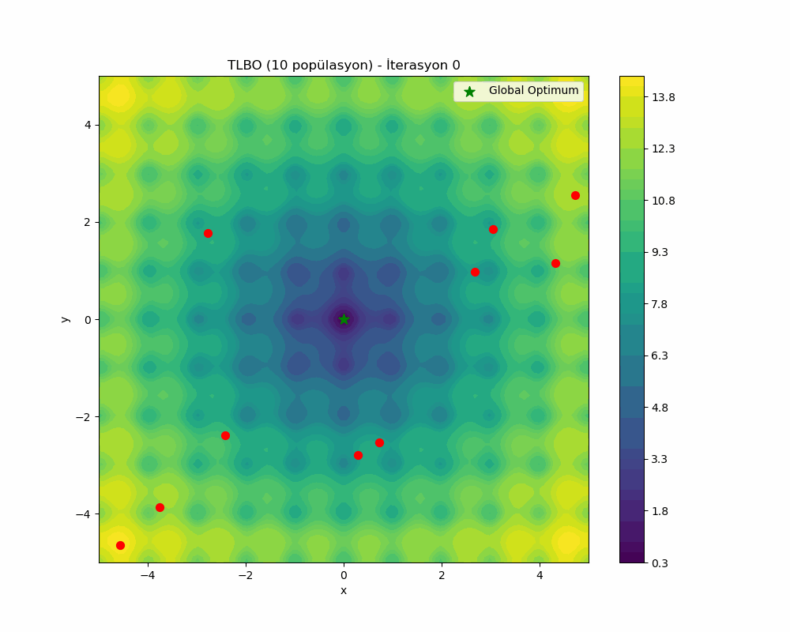

# Comparison of Single Solution and Population-Based Optimization Algorithms

This project compares the performance of population-based (TLBO) and single-solution (Tabu Search) optimization algorithms on the Ackley function. The behavior of both algorithms in approaching the optimum is examined through visualizations.



## Algorithm Animations

The optimization process of each algorithm has been recorded in GIF format:

### TLBO (5 population)


### TLBO (10 population)


### Tabu Search


## Problem Definition

This study uses the Ackley function, which is a frequently used multimodal (multiple local optima) test function for optimization algorithms. The function is defined as follows:

```
f(x,y) = -20 * exp(-0.2 * sqrt(0.5 * (x^2 + y^2))) - exp(0.5 * (cos(2π*x) + cos(2π*y))) + e + 20
```

The global minimum of this function is at point (0, 0) with a value of 0. The function has many local minima, which allows for visualization of the challenges optimization algorithms face in reaching the global optimum.

## Algorithms Used

### TLBO (Teaching-Learning Based Optimization)

TLBO is a population-based metaheuristic optimization algorithm. The algorithm is inspired by the teaching and learning process between a teacher and students. The algorithm consists of two main phases:

1. **Teacher Phase**: The best solution in the population is selected as the teacher, and other solutions (students) move towards the teacher.
2. **Learner Phase**: Randomly selected students learn from each other; they move towards the better student.

In the project, the TLBO algorithm was tested using two different population sizes (5 and 10).

### Tabu Search

Tabu Search is a metaheuristic optimization algorithm that uses a single solution. The algorithm uses a memory structure called a "tabu list" to overcome local minima. This list contains solutions that the algorithm has recently visited and prohibits returning to these solutions during the search process. This allows the algorithm to explore the search space more effectively without getting stuck in previously visited areas.

#### Improvements Made to the Tabu Search Algorithm

The initial version of the algorithm was prone to getting stuck in local optima. The following improvements were made to enhance the algorithm's ability to find the global optimum:

1. **Diversification Strategy**: 
   - Using multiple starting points (grid and random points) to explore the search space more broadly.
   - Jumping to new random points when there is no improvement for a long time, allowing escape from local optima.

2. **Improvement of Neighborhood Structure**:
   - Defining movements at different scales (0.5x, 1x, 2x step sizes) allowing the algorithm to take both small and large steps.
   - Adding completely random neighbors to increase exploration capability.

3. **Tabu List and Aspiration Criterion**:
   - Increasing the tabu list size for the algorithm to work with longer memory.
   - Relaxing the aspiration criterion when there is no improvement for a long time, providing wider search opportunities.

4. **Parameter Settings**:
   - Increased the number of iterations from 300 to 1500
   - Increased the tabu list size from 5 to 25
   - Increased the number of starting points for diversification to 9

As a result of these improvements, the Tabu Search algorithm became capable of successfully finding the global optimum.

## Algorithm Results

Results obtained from the last run:

| Algorithm | Best Solution (x, y) | Fitness Value |
|-----------|---------------------:|---------------:|
| TLBO (5 population) | (1.76e-15, 1.97e-14) | 5.68e-14 |
| TLBO (10 population) | (-1.90e-07, 9.90e-07) | 2.85e-06 |
| Tabu Search | (0.0, 0.0) | 0.0 |

**Before vs. After Improvements:**

| Algorithm | Initial Fitness Value | Final Fitness Value | Improvement |
|-----------|-------------------:|-------------------:|:---------:|
| Tabu Search | 8.87 | 0.0 | 100% |

Thanks to the improvements made, the Tabu Search algorithm has become capable of finding the global optimum exactly. This result demonstrates that even single-solution algorithms can provide effective results in complex optimization problems when the right parameters and strategies are used.

Note that; in tabu search, step size is used. So, reaching to the exact optimum point is related with that approach.

### Observations and Future Improvements

During the operation of the Tabu Search algorithm, it was observed that it tends to visit solutions in the tabu list. This behavior can reduce the overall efficiency of the algorithm. For future improvements, the following can be considered:

1. **Increasing the tabu distance threshold**: The distance threshold in the `is_tabu` function can be increased to mark wider areas as tabu.

2. **Dynamic tabu tenure**: The time solutions remain in the tabu list can be changed based on the quality of solutions (shorter tabu tenure for good solutions, longer for poor solutions).

3. **More effective diversification**: When the algorithm shows no improvement for a long time, it can make jumps to more distant points.

Despite these potential improvements, the current implementation has succeeded in finding the global optimum.

## Differences Between Population-Based and Single-Solution Algorithms

### Population-Based Algorithms (TLBO)
- **Advantages**:
  - They can explore a wider area of the search space
  - They have a higher probability of escaping local minima
  - They can perform parallel searches
- **Disadvantages**:
  - They may require more computational resources
  - The selection of population size can affect the algorithm's performance

### Single-Solution Algorithms (Tabu Search)
- **Advantages**:
  - They generally require less memory and processing power
  - They can provide faster results for certain types of problems
  - They can reach the global optimum with well-designed diversification and intensification strategies
- **Disadvantages**:
  - They have a higher probability of getting stuck in local minima (when appropriate strategies are not used)
  - They require special strategies for exploring the search space

## Requirements

You need the following Python libraries to run this code:

```
numpy
matplotlib
imageio
```

To install the dependencies:

```bash
pip install numpy matplotlib imageio
```

## Usage

To run the algorithms and generate visualizations:

```bash
python s_vs_p.py
```

This command runs the algorithms and saves the visualizations to the `visualizations` directory.

## Conclusion and Observations

When examining the visualizations and results:

1. **The TLBO algorithm** is quite successful in finding the global optimum in the multimodal Ackley function. Even with a population of 5, it achieved a very good fitness value of 5.68e-14.

2. **The Tabu Search algorithm** initially tended to get stuck in local minima, but as a result of the improvements made, it became capable of finding the global optimum exactly.

3. **Population size** affects the performance of the TLBO algorithm. In this run, interestingly, better results were obtained with a population of 5 compared to a population of 10. This shows that more population may not always yield better results, and parameter settings and the number of iterations are also important.

4. **Algorithm parameters and strategies** can dramatically affect optimization success. With the right parameters and strategies, even a single-solution algorithm can produce results as good as population-based algorithms in complex problems.

This study shows that both population-based and single-solution algorithms can provide effective results when properly tuned. Depending on the structure of the problem and computational resources, both types of algorithms can be utilized. 

## License

This project is provided as an educational resource and is free to use and modify. 