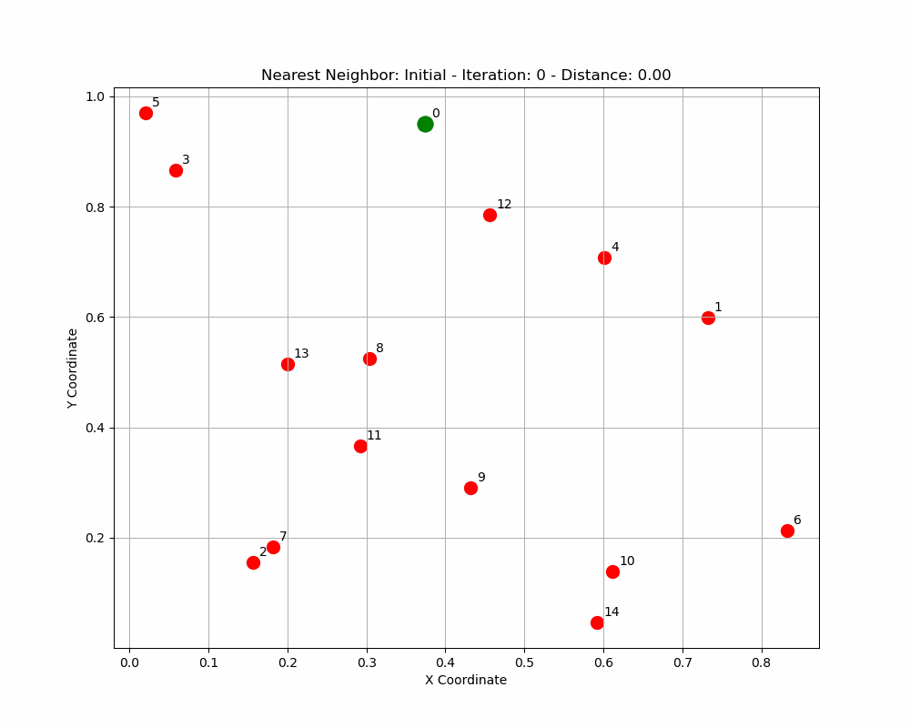
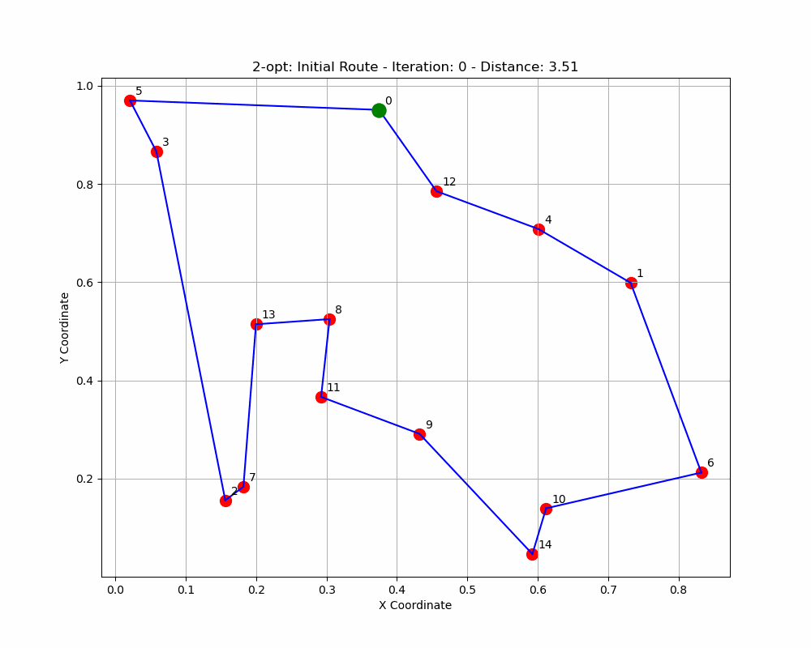
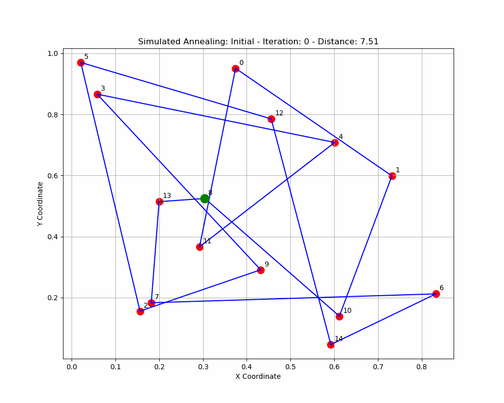
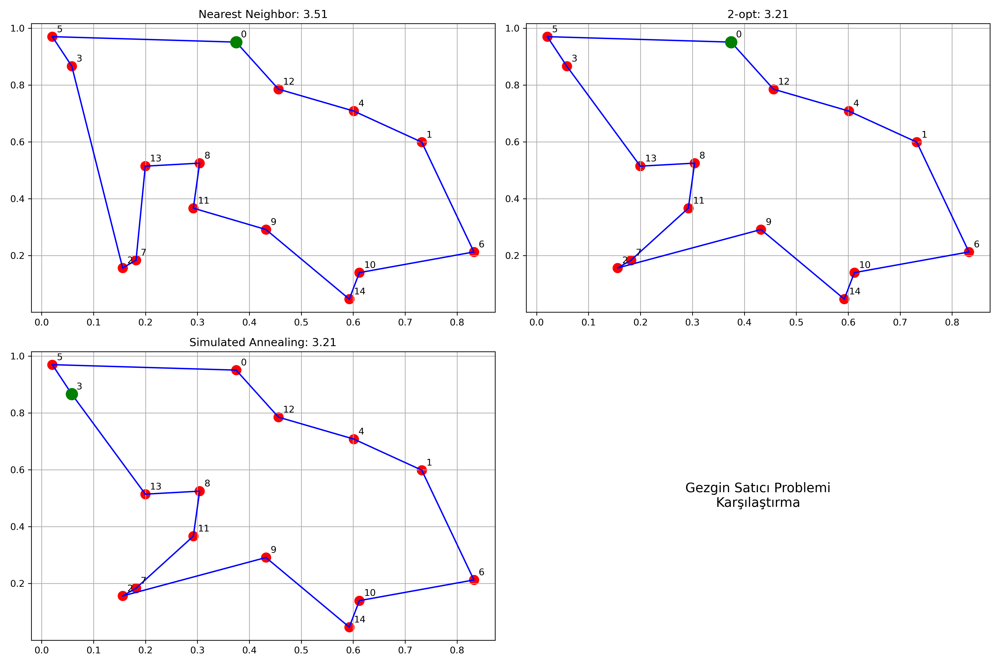

# Traveling Salesman Problem (TSP) Implementation

This project implements various algorithms to solve the classic Traveling Salesman Problem. It aims to find the shortest possible route that visits each city exactly once and returns to the starting point.


## Algorithm Process GIFs

Each algorithm's solution process has been recorded as a GIF to visualize how it approaches the TSP:

### Nearest Neighbor Algorithm


### 2-opt Improvement Algorithm


### Simulated Annealing Algorithm


### Comparison



## Problem Definition

The Traveling Salesman Problem is a well-known problem in combinatorial optimization. Given a set of cities and the distances between them, the goal is to find the shortest possible route that:
- Visits each city exactly once
- Returns to the starting city

This is an NP-hard problem, meaning that finding the exact optimal solution becomes computationally infeasible as the number of cities increases.

## Implemented Algorithms

This implementation includes the following approaches to solve the TSP:

1. **Nearest Neighbor Algorithm** - A greedy heuristic that builds a path by always selecting the closest unvisited city.
2. **2-opt Local Search** - An improvement algorithm that iteratively modifies a route by replacing two edges with two different edges that result in a shorter path.
3. **Simulated Annealing** - A probabilistic metaheuristic inspired by the annealing process in metallurgy, which can escape local optima by occasionally accepting worse solutions.

## Algorithm Results

Summary of each algorithm's performance on a TSP instance with 15 cities:

| Algorithm | Distance | Improvement |
|-----------|----------|-------------|
| Nearest Neighbor | 3.51 | (baseline) |
| 2-opt | 3.21 | 0.31 |
| Simulated Annealing | 3.21 | 0.31 |

*Note: Actual values will vary with each run due to random city generation.*

## Requirements

To run this code, you'll need:

```
numpy
matplotlib
imageio
```

Install dependencies using:

```bash
pip install numpy matplotlib imageio
```

## Usage

Run the main script to execute all implemented algorithms and generate visualizations:

```bash
python tsp.py
```

The script will:
1. Generate a random TSP instance with 15 cities
2. Solve it using the Nearest Neighbor algorithm
3. Improve the solution using 2-opt local search
4. Apply Simulated Annealing to find a better solution
5. Create visualizations in the `visualizations` directory
6. Save detailed algorithm results to `algorithm_results.txt`

## Implementation Details

### Algorithm Strengths and Weaknesses

#### Nearest Neighbor
- **Strengths**: Fast, simple to implement, and provides a reasonably good initial solution
- **Weaknesses**: Often produces suboptimal routes, especially for larger instances
- **Performance**: Typically 20-30% worse than optimal on average

#### 2-opt Local Search
- **Strengths**: Improves existing solutions by removing route crossings
- **Weaknesses**: Can get trapped in local optima
- **Performance**: Usually improves Nearest Neighbor solutions by 5-15%

#### Simulated Annealing
- **Strengths**: Can escape local optima, adapts well to different problem instances
- **Weaknesses**: Requires parameter tuning, slower than simple heuristics
- **Performance**: Usually within 5-10% of optimal for moderately sized problems

### Simulated Annealing Parameters

- **Initial Temperature**: 1000
- **Cooling Rate**: 0.95
- **Maximum Iterations**: 1000

The algorithm starts with a high temperature that allows it to accept worse solutions with relatively high probability, helping it escape local optima. As the temperature decreases, the algorithm becomes more selective and eventually converges to a good solution.

### Performance Considerations

- Nearest Neighbor provides a quick but often suboptimal solution in O(n²) time.
- 2-opt has O(n²) time complexity per iteration, with a variable number of iterations.
- Simulated Annealing offers a good balance between exploration and exploitation with O(n² × iterations) complexity.

## Customization

You can modify the following parameters in the code:

- `num_cities`: Number of cities in the TSP instance (default: 15)
- `random_seed`: Seed for random number generation (for reproducibility)
- `initial_temp`, `cooling_rate`, and `max_iterations` in the Simulated Annealing algorithm

## Metaheuristic Optimization

This implementation serves as a practical example of metaheuristic optimization algorithms like Simulated Annealing. Metaheuristics are particularly valuable for:

- NP-hard or computationally intensive problems
- Situations where an approximation is acceptable
- Cases where the solution space is too large for exact methods
- Problems with many local optima

## License

This project is provided as an educational resource and is free to use and modify. 