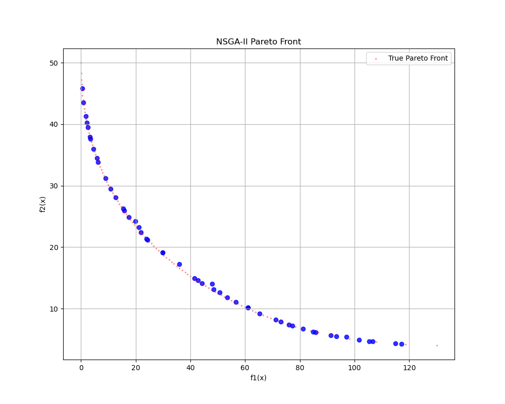
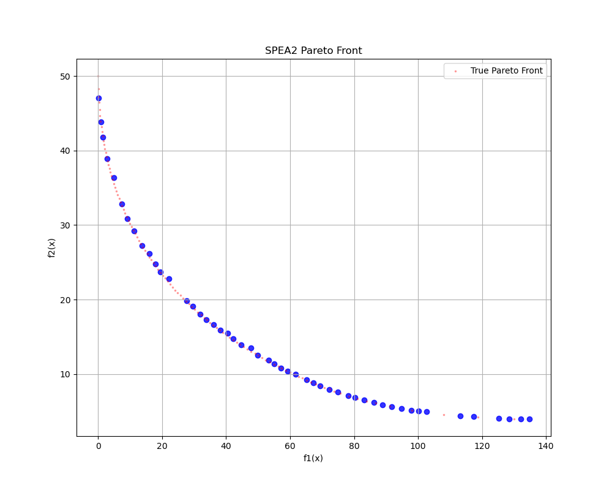
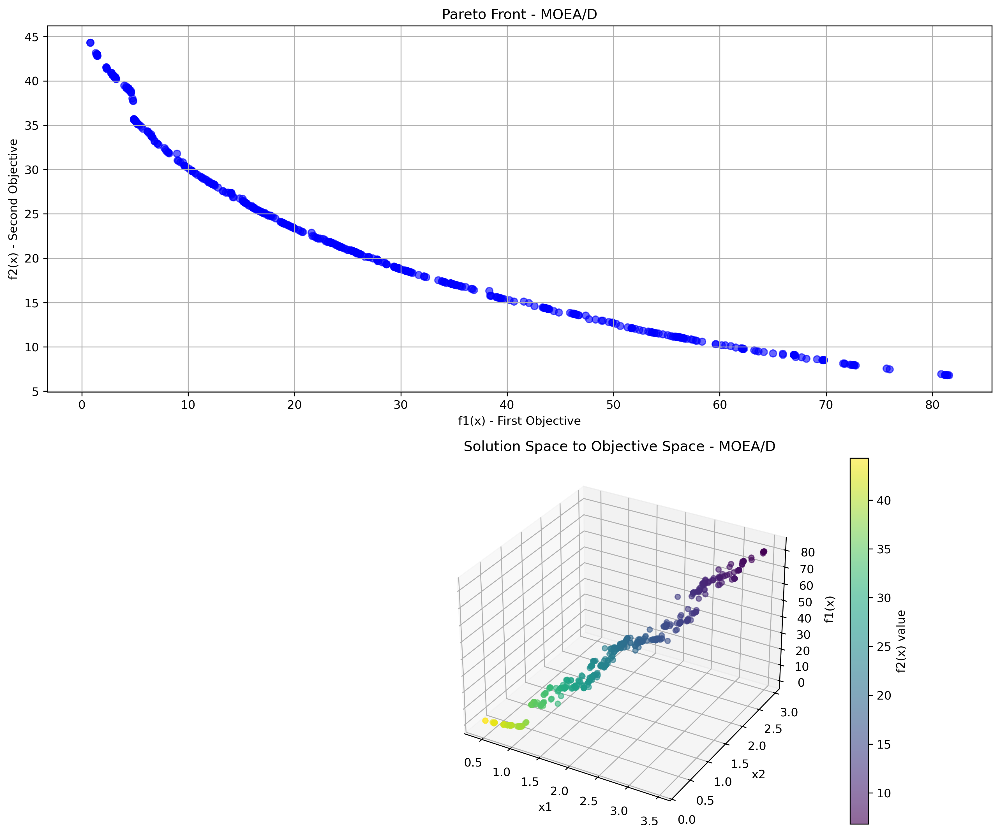
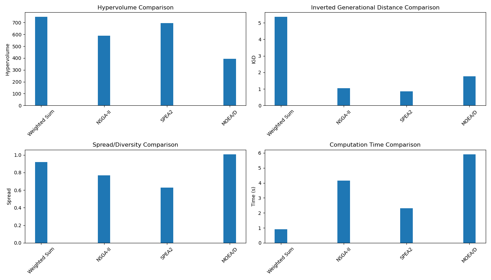

# Çok Amaçlı Optimizasyon Algoritmaları ve Performans Karşılaştırması

Bu repo, çok amaçlı optimizasyon tekniklerini öğrenmek isteyen öğrenciler için hazırlanmış bir kaynak ve referans uygulamadır. İçerisinde dört farklı popüler çok amaçlı optimizasyon algoritmasının (Weighted Sum, NSGA-II, SPEA2 ve MOEA/D) Python ile uygulamaları ve Binh and Korn test fonksiyonu üzerinde karşılaştırmalı performans analizleri bulunmaktadır.

## İçindekiler

1. [Giriş](#giriş)
2. [Problem Tanımı: Binh and Korn Fonksiyonu](#problem-tanımı-binh-and-korn-fonksiyonu)
3. [Uygulanan Algoritmalar](#uygulanan-algoritmalar)
4. [Performans Metrikleri](#performans-metrikleri)
5. [Deneysel Sonuçlar](#deneysel-sonuçlar)
6. [Karşılaştırmalı Analiz](#karşılaştırmalı-analiz)
7. [Algoritmaların Güçlü ve Zayıf Yönleri](#algoritmaların-güçlü-ve-zayıf-yönleri)
8. [Kurulum ve Kullanım](#kurulum-ve-kullanım)
9. [Sonuç](#sonuç)

## Giriş

Çok amaçlı optimizasyon (Multi-objective Optimization), gerçek hayattaki birçok mühendislik probleminde olduğu gibi birbiriyle çelişen birden fazla amacı eş zamanlı olarak optimize etmeyi amaçlar. Bu tür problemlerde tek bir "en iyi" çözüm yerine, Pareto-optimal olarak adlandırılan bir çözüm kümesi elde edilir.

Bu projede, yaygın olarak kullanılan dört farklı çok amaçlı optimizasyon algoritmasını uyguladık ve başarımlarını karşılaştırdık:

1. **Weighted Sum (Ağırlıklı Toplam)** - Basit ve klasik bir skalerleştirme yaklaşımı
2. **NSGA-II (Non-dominated Sorting Genetic Algorithm II)** - Yapısında hızlı baskınlık sıralaması ve çeşitlilik koruması içeren popüler bir evrimsel algoritma
3. **SPEA2 (Strength Pareto Evolutionary Algorithm 2)** - Arşiv tabanlı, uygunluk ataması için geliştirilmiş stratejiler kullanan bir evrimsel algoritma
4. **MOEA/D (Multi-Objective Evolutionary Algorithm based on Decomposition)** - Problemi alt problemlere ayırarak çözen bir ayrıştırma yaklaşımı

## Problem Tanımı: Binh and Korn Fonksiyonu

Algoritmalarımızı test etmek için çok amaçlı optimizasyon literatüründe sıkça kullanılan Binh and Korn test fonksiyonunu kullandık:

### Amaç Fonksiyonları
- **f₁(x)** = 4x₁² + 4x₂²  (Minimize)
- **f₂(x)** = (x₁ - 5)² + (x₂ - 5)²  (Minimize)

### Kısıtlar
- **g₁(x)**: (x₁ - 5)² + x₂² ≤ 25
- **g₂(x)**: (x₁ - 8)² + (x₂ + 3)² ≥ 7.7

### Değişken Sınırları
- 0 ≤ x₁ ≤ 5
- 0 ≤ x₂ ≤ 3

## Uygulanan Algoritmalar

### 1. Weighted Sum (Ağırlıklı Toplam) Yöntemi

Bu, belki de çok amaçlı optimizasyon için en basit yaklaşımdır. Her amaç fonksiyonuna bir ağırlık atanır ve bu ağırlıklı toplamı minimize eden tek bir çözüm aranır. Bu çalışmada, Pareto cephesini daha iyi elde edebilmek için farklı ağırlık vektörleri ile tekrarlı bir yaklaşım kullandık.

#### Özet Algoritma
```
1. Farklı ağırlık vektörleri oluştur (örn. w = [0.1, 0.9], [0.2, 0.8], ..., [0.9, 0.1])
2. Her ağırlık vektörü için:
   a. Genetik algoritma başlat
   b. Popülasyon içindeki bireylerin ağırlıklı toplam değerlerini hesapla: f(x) = w₁·f₁(x) + w₂·f₂(x)
   c. Çaprazlama, mutasyon ve seçim operatörleriyle evrimleştir
   d. En iyi bireyi al
3. Tüm ağırlık vektörlerinden elde edilen çözümleri birleştir
4. Baskın olmayan çözümleri bul (Pareto cephesi)
```

### 2. NSGA-II (Non-dominated Sorting Genetic Algorithm II)

Deb ve arkadaşları tarafından geliştirilen NSGA-II, çok amaçlı evrimsel algoritmaların en popülerlerinden biridir. Hızlı baskınlık sıralaması ve kalabalık mesafe (crowding distance) mekanizmalarını kullanır.

#### Özet Algoritma
```
1. Popülasyonu oluştur ve değerlendir
2. Her nesil için:
   a. Ebeveyn popülasyonundan çaprazlama ve mutasyon ile çocuk popülasyonu oluştur
   b. Ebeveyn ve çocuk popülasyonunu birleştir
   c. Hızlı baskınlık sıralaması ile cephelere ayır
   d. Her cephe içinde kalabalık mesafe hesapla
   e. Bir sonraki nesil için en iyi bireyleri seç
3. Son popülasyondan Pareto-optimal cepheyi döndür
```

### 3. SPEA2 (Strength Pareto Evolutionary Algorithm 2)

SPEA2, bir arşiv mekanizması kullanır ve her bireyin gücünü (strength) hesaplar. Ayrıca kümeleme mekanizmasıyla Pareto cephesinin düzgün dağılımını sağlar.

#### Özet Algoritma
```
1. Popülasyonu oluştur ve boş bir arşiv başlat
2. Her nesil için:
   a. Popülasyon ve arşivi birleştir
   b. Her birey için güç ve uygunluk değerlerini hesapla
   c. Arşive baskın olmayan bireyleri ekle, boyut aşılırsa kümeleme ile azalt
   d. Arşivden ikili turnuva ile ebeveynleri seç
   e. Çaprazlama ve mutasyon ile yeni popülasyon oluştur
3. Son arşivi döndür
```

### 4. MOEA/D (Multi-Objective Evolutionary Algorithm based on Decomposition)

MOEA/D, çok amaçlı problemi bir dizi tek amaçlı alt probleme ayrıştırır ve bunları eş zamanlı olarak çözer. Her alt problem, komşu alt problemlerin bilgisini kullanabilir.

#### Özet Algoritma
```
1. Ağırlık vektörleri oluştur ve komşuluk yapısını belirle
2. Popülasyonu oluştur, değerlendir ve ideal noktayı başlat
3. Her nesil için:
   a. Her alt problem için:
      i. Komşu bireylerden yeni çözümler üret (çaprazlama ve mutasyon)
      ii. İdeal noktayı güncelle
      iii. Komşu alt problemlerdeki çözümleri güncelle (Tchebycheff yaklaşımı)
      iv. Harici popülasyonu güncelle (baskın olmayan çözümler)
4. Harici popülasyonu döndür
```

## Performans Metrikleri

Algoritmaların karşılaştırmalı analizi için şu metrikleri kullandık:

### 1. Hypervolume (Hacim)
Pareto cephesinin referans noktasına göre kapladığı alanın/hacmin ölçüsüdür. **Daha yüksek** değerler daha iyidir.

### 2. IGD (Inverted Generational Distance)
Gerçek Pareto cephesi ile bulunan çözüm kümesi arasındaki mesafenin bir ölçüsüdür. **Daha düşük** değerler daha iyidir.

### 3. Spread (Yayılım/Çeşitlilik)
Çözüm kümesindeki noktaların birbirlerine olan uzaklığının ölçüsüdür. Düzgün dağılmış bir Pareto cephesi için **daha düşük** değerler daha iyidir.

### 4. Hesaplama Süresi
Algoritmanın tamamlanma süresi. **Daha düşük** değerler daha iyidir.

## Deneysel Sonuçlar

Tüm algoritmalar aşağıdaki parametrelerle çalıştırılmıştır:

- Popülasyon Büyüklüğü: 50
- Maksimum Nesil Sayısı: 30
- Çaprazlama Oranı: 0.9
- Mutasyon Oranı: 0.1
- Karar Değişkeni Sınırları: x₁ ∈ [0, 5], x₂ ∈ [0, 3]

### Algoritmaların Bireysel Pareto Cepheleri

#### Weighted Sum (Ağırlıklı Toplam) Yöntemi


#### NSGA-II


#### SPEA2


#### MOEA/D


### Tüm Algoritmaların Karşılaştırmalı Pareto Cepheleri


### 3D Gösterimler (Çözüm Uzayı ve Amaç Uzayı)

#### Weighted Sum 3D


#### NSGA-II 3D


#### SPEA2 3D


#### MOEA/D 3D


### Performans Metrikleri Karşılaştırması


## Karşılaştırmalı Analiz

### Performans Metrik Değerleri

| Algoritma | Hypervolume | IGD | Spread | Hesaplama Süresi (s) |
|-----------|-------------|-----|--------|----------------------|
| Weighted Sum | 747.99 | 5.36 | 0.92 | 0.90 |
| NSGA-II | 588.20 | 1.04 | 0.77 | 4.16 |
| SPEA2 | 695.83 | 0.86 | 0.63 | 2.32 |
| MOEA/D | 394.15 | 1.77 | 1.01 | 5.91 |

## Algoritmaların Güçlü ve Zayıf Yönleri

### Weighted Sum (Ağırlıklı Toplam) Yöntemi
- **Güçlü Yönleri**:
  - En yüksek hypervolume değerine sahip
  - En hızlı algoritma (0.90 saniye)
  - Uygulaması basit ve anlaşılması kolay
- **Zayıf Yönleri**:
  - IGD değeri diğer algoritmalara göre oldukça yüksek
  - İçbükey Pareto cephelerini bulmakta zorlanabilir

### NSGA-II
- **Güçlü Yönleri**:
  - Dengeli bir genel performans
  - Düşük IGD ve makul bir spread değeri
  - Genel amaçlı kullanım için güvenilir
- **Zayıf Yönleri**:
  - SPEA2'ye göre daha yavaş ve daha az etkili
  - Hypervolume değeri düşük

### SPEA2
- **Güçlü Yönleri**:
  - En düşük IGD değeri (0.86)
  - En düşük spread değeri (0.63) - en iyi dağılım
  - Makul bir hesaplama süresi
  - Hypervolume değeri NSGA-II'den iyi
- **Zayıf Yönleri**:
  - Weighted Sum'dan daha yavaş
  - Uygulama karmaşıklığı yüksek

### MOEA/D
- **Güçlü Yönleri**:
  - Teorik olarak karmaşık problemlerde daha iyi sonuçlar verebilir
  - Çeşitli ayrıştırma yaklaşımları kullanılabilir
- **Zayıf Yönleri**:
  - Bu problem için en düşük hypervolume değeri
  - En yüksek hesaplama süresi (5.91 saniye)
  - En kötü spread değeri

## Kurulum ve Kullanım

### Gereksinimler
Bu projeyi çalıştırmak için aşağıdaki Python kütüphanelerine ihtiyaç vardır:
```
numpy>=1.20.0
matplotlib>=3.4.0
scipy>=1.7.0
```

Gereksinimleri yüklemek için:
```bash
pip install -r requirements.txt
```

### Çalıştırma
Tüm algoritmaları çalıştırmak ve sonuçları görselleştirmek için:
```bash
python main.py
```

Çıktılar `results` klasöründe saklanacaktır.

## Sonuç

Bu çalışmada dört farklı çok amaçlı optimizasyon algoritmasını uyguladık ve Binh and Korn test fonksiyonu üzerinde karşılaştırdık. Sonuçlarımız, her algoritmanın belirli güçlü ve zayıf yönleri olduğunu göstermektedir:

1. **Weighted Sum** algoritması en düşük hesaplama süresine ve en yüksek hypervolume değerine sahiptir, ancak IGD açısından en kötü performansı göstermektedir. Farklı ağırlık vektörleriyle yaklaşımımız, daha geniş bir Pareto cephesi elde etmemizi sağlamıştır.

2. **SPEA2** genel olarak en iyi dengeyi sunmaktadır - en düşük IGD, en düşük spread, ve iyi bir hypervolume değeri. Bu sonuçlar, SPEA2'nin arşiv mekanizması ve gelişmiş uygunluk hesaplama stratejisinin etkinliğini doğrulamaktadır.

3. **NSGA-II** dengeli bir performans göstermektedir ve genel amaçlı kullanım için güvenilir bir seçenektir.

4. **MOEA/D** bu problem için diğer algoritmalara göre daha yavaş ve daha az etkili olmuştur, ancak daha karmaşık problemlerde ve yüksek boyutlu karar uzaylarında performansı artabilir.

Öğrencilerin çok amaçlı optimizasyon problemlerini anlamaları ve farklı algoritmaların davranışlarını karşılaştırmaları için bu proje iyi bir başlangıç noktası olabilir. Algoritmalar farklı mühendislik ve tasarım problemlerine kolayca uyarlanabilir.

Bu çalışma, gerçek dünya problemlerini çözmek için bu algoritmaların uygulanması ve geliştirilmesinde bir kılavuz olarak kullanılabilir. 