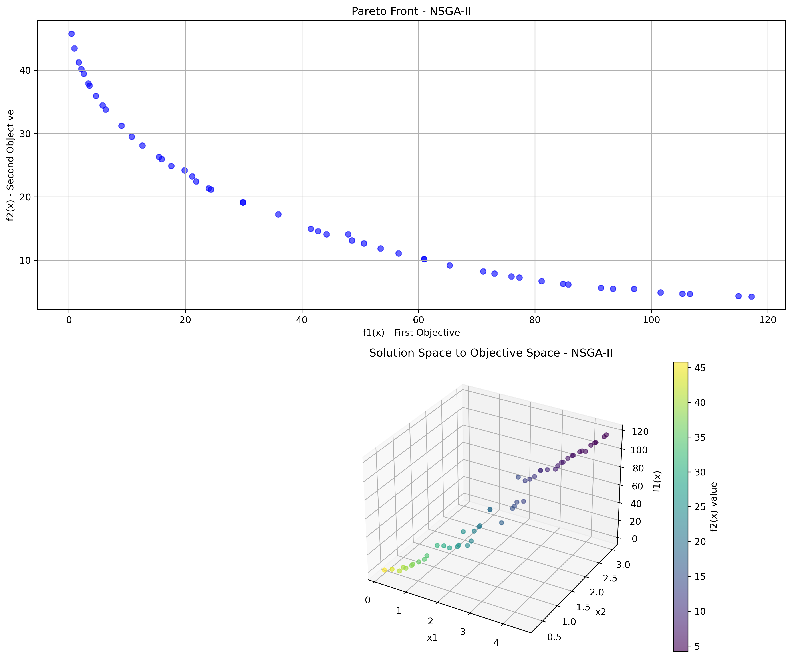

# Multi-Objective Optimization Algorithms and Performance Comparison

This repository is a resource and reference implementation for students who want to learn multi-objective optimization techniques. It contains Python implementations of four different popular multi-objective optimization algorithms (Weighted Sum, NSGA-II, SPEA2, and MOEA/D) and comparative performance analyses on the Binh and Korn test function.

## Table of Contents

1. [Introduction](#introduction)
2. [Problem Definition: Binh and Korn Function](#problem-definition-binh-and-korn-function)
3. [Implemented Algorithms](#implemented-algorithms)
4. [Performance Metrics](#performance-metrics)
5. [Experimental Results](#experimental-results)
6. [Comparative Analysis](#comparative-analysis)
7. [Strengths and Weaknesses of Algorithms](#strengths-and-weaknesses-of-algorithms)
8. [Setup and Usage](#setup-and-usage)
9. [Conclusion](#conclusion)

## Introduction

Multi-objective optimization aims to simultaneously optimize multiple conflicting objectives, as is common in many real-world engineering problems. In such problems, instead of a single "best" solution, a set of solutions called Pareto-optimal solutions is obtained.

In this project, we implemented and compared the performance of four widely used multi-objective optimization algorithms:

1. **Weighted Sum** - A simple and classic scalarization approach
2. **NSGA-II (Non-dominated Sorting Genetic Algorithm II)** - A popular evolutionary algorithm that includes fast non-dominated sorting and diversity preservation mechanisms
3. **SPEA2 (Strength Pareto Evolutionary Algorithm 2)** - An archive-based evolutionary algorithm that uses enhanced fitness assignment strategies
4. **MOEA/D (Multi-Objective Evolutionary Algorithm based on Decomposition)** - A decomposition approach that breaks the problem into sub-problems

## Problem Definition: Binh and Korn Function

We used the Binh and Korn test function, which is commonly used in the multi-objective optimization literature to test our algorithms:

### Objective Functions
- **f₁(x)** = 4x₁² + 4x₂²  (Minimize)
- **f₂(x)** = (x₁ - 5)² + (x₂ - 5)²  (Minimize)

### Constraints
- **g₁(x)**: (x₁ - 5)² + x₂² ≤ 25
- **g₂(x)**: (x₁ - 8)² + (x₂ + 3)² ≥ 7.7

### Variable Bounds
- 0 ≤ x₁ ≤ 5
- 0 ≤ x₂ ≤ 3

## Implemented Algorithms

### 1. Weighted Sum Method

This is perhaps the simplest approach for multi-objective optimization. A weight is assigned to each objective function, and a single solution is sought that minimizes this weighted sum. In this study, we used an iterative approach with different weight vectors to better obtain the Pareto front.

#### Algorithm Summary
```
1. Create different weight vectors (e.g., w = [0.1, 0.9], [0.2, 0.8], ..., [0.9, 0.1])
2. For each weight vector:
   a. Start genetic algorithm
   b. Calculate weighted sum values of individuals in the population: f(x) = w₁·f₁(x) + w₂·f₂(x)
   c. Evolve using crossover, mutation, and selection operators
   d. Take the best individual
3. Combine solutions obtained from all weight vectors
4. Find non-dominated solutions (Pareto front)
```

### 2. NSGA-II (Non-dominated Sorting Genetic Algorithm II)

Developed by Deb et al., NSGA-II is one of the most popular multi-objective evolutionary algorithms. It uses fast non-dominated sorting and crowding distance mechanisms.

#### Algorithm Summary
```
1. Create and evaluate the population
2. For each generation:
   a. Create child population from parent population through crossover and mutation
   b. Combine parent and child populations
   c. Separate into fronts using fast non-dominated sorting
   d. Calculate crowding distance within each front
   e. Select the best individuals for the next generation
3. Return the Pareto-optimal front from the final population
```

### 3. SPEA2 (Strength Pareto Evolutionary Algorithm 2)

SPEA2 uses an archive mechanism and calculates the strength of each individual. It also ensures an even distribution of the Pareto front through a clustering mechanism.

#### Algorithm Summary
```
1. Create population and initialize an empty archive
2. For each generation:
   a. Combine population and archive
   b. Calculate strength and fitness values for each individual
   c. Add non-dominated individuals to the archive, reduce with clustering if size is exceeded
   d. Select parents from the archive using binary tournament
   e. Create new population through crossover and mutation
3. Return the final archive
```

### 4. MOEA/D (Multi-Objective Evolutionary Algorithm based on Decomposition)

MOEA/D decomposes the multi-objective problem into a series of single-objective sub-problems and solves them simultaneously. Each sub-problem can use information from neighboring sub-problems.

#### Algorithm Summary
```
1. Create weight vectors and determine neighborhood structure
2. Create and evaluate the population, initialize the ideal point
3. For each generation:
   a. For each sub-problem:
      i. Generate new solutions from neighboring individuals (crossover and mutation)
      ii. Update the ideal point
      iii. Update solutions in neighboring sub-problems (Tchebycheff approach)
      iv. Update external population (non-dominated solutions)
4. Return the external population
```

## Performance Metrics

We used the following metrics for comparative analysis of the algorithms:

### 1. Hypervolume
A measure of the area/volume covered by the Pareto front relative to a reference point. **Higher** values are better.

### 2. IGD (Inverted Generational Distance)
A measure of the distance between the true Pareto front and the found solution set. **Lower** values are better.

### 3. Spread (Diversity)
A measure of the distance between points in the solution set. For a well-distributed Pareto front, **lower** values are better.

### 4. Computation Time
The completion time of the algorithm. **Lower** values are better.

## Experimental Results

All algorithms were run with the following parameters:

- Population Size: 50
- Maximum Number of Generations: 30
- Crossover Rate: 0.9
- Mutation Rate: 0.1
- Decision Variable Bounds: x₁ ∈ [0, 5], x₂ ∈ [0, 3]

### Individual Pareto Fronts of Algorithms

#### Weighted Sum Method


#### NSGA-II


#### SPEA2


#### MOEA/D


### Comparative Pareto Fronts of All Algorithms


### 3D Visualizations (Solution Space and Objective Space)

#### Weighted Sum 3D


#### NSGA-II 3D


#### SPEA2 3D


#### MOEA/D 3D


### Performance Metrics Comparison


## Comparative Analysis

### Performance Metric Values

| Algorithm | Hypervolume | IGD | Spread | Computation Time (s) |
|-----------|-------------|-----|--------|----------------------|
| Weighted Sum | 747.99 | 5.36 | 0.92 | 0.90 |
| NSGA-II | 588.20 | 1.04 | 0.77 | 4.16 |
| SPEA2 | 695.83 | 0.86 | 0.63 | 2.32 |
| MOEA/D | 394.15 | 1.77 | 1.01 | 5.91 |

## Strengths and Weaknesses of Algorithms

### Weighted Sum Method
- **Strengths**:
  - Highest hypervolume value
  - Fastest algorithm (0.90 seconds)
  - Simple implementation and easy to understand
- **Weaknesses**:
  - IGD value significantly higher than other algorithms
  - May struggle to find concave Pareto fronts

### NSGA-II
- **Strengths**:
  - Balanced overall performance
  - Low IGD and reasonable spread value
  - Reliable for general use
- **Weaknesses**:
  - Slower and less effective than SPEA2
  - Low hypervolume value

### SPEA2
- **Strengths**:
  - Lowest IGD value (0.86)
  - Lowest spread value (0.63) - best distribution
  - Reasonable computation time
  - Hypervolume value better than NSGA-II
- **Weaknesses**:
  - Slower than Weighted Sum
  - High implementation complexity

### MOEA/D
- **Strengths**:
  - Theoretically can yield better results in complex problems
  - Various decomposition approaches can be used
- **Weaknesses**:
  - Lowest hypervolume value for this problem
  - Highest computation time (5.91 seconds)
  - Worst spread value

## Setup and Usage

### Requirements
The following Python libraries are needed to run this project:
```
numpy>=1.20.0
matplotlib>=3.4.0
scipy>=1.7.0
```

To install requirements:
```bash
pip install -r requirements.txt
```

### Running
To run all algorithms and visualize results:
```bash
python main.py
```

Outputs will be saved in the `results` directory.

## Conclusion

In this study, we implemented four different multi-objective optimization algorithms and compared them on the Binh and Korn test function. Our results show that each algorithm has specific strengths and weaknesses:

1. **Weighted Sum** algorithm has the lowest computation time and highest hypervolume value, but shows the worst performance in terms of IGD. Our approach with different weight vectors has allowed us to obtain a wider Pareto front.

2. **SPEA2** offers the best overall balance - lowest IGD, lowest spread, and a good hypervolume value. These results confirm the effectiveness of SPEA2's archive mechanism and enhanced fitness calculation strategy.

3. **NSGA-II** shows balanced performance and is a reliable option for general use.

4. **MOEA/D** was slower and less effective than other algorithms for this problem, but its performance may improve in more complex problems and high-dimensional decision spaces.

This project can be a good starting point for students to understand multi-objective optimization problems and compare the behavior of different algorithms. The algorithms can be easily adapted to different engineering and design problems.

This study can be used as a guide for implementing and developing these algorithms to solve real-world problems. 