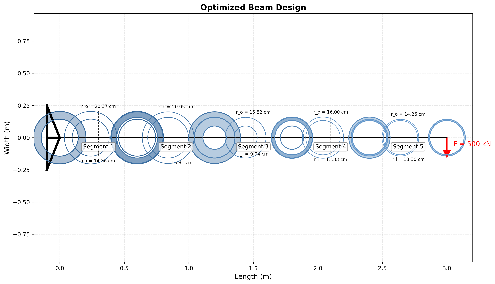

# Cantilever Beam Optimization

This project involves the optimal design of a 3m long cantilever beam consisting of 5 segments, aiming to minimize weight under specific constraints. The Simulated Annealing algorithm is used for optimization.

## Problem Definition

- A 3m long cantilever beam divided into 5 equal segments
- Each segment has a hollow circular cross-section with two design parameters:
  - r_i1 (outer radius)
  - r_i2 (inner radius)
- Material: S270 steel (E = 210 GPa, σy = 270 MPa)
- A perpendicular force of F = 500 kN is applied at the free end of the beam
- Objective: Minimize the beam weight

### Constraints
1. Maximum displacement of 2 cm is allowed at the beam's free end
2. For each segment, the outer radius must be greater than the inner radius
3. The inner radius of the preceding segment must be smaller than the outer radius of the following segment (weldability condition)
4. The yield stress of S270 steel (270 MPa) must not be exceeded

## Structural Analysis and Optimization Approach

### Finite Element Analysis
The cantilever beam's displacement and stress analysis uses the finite element method:

- Each beam segment is modeled as an Euler-Bernoulli beam element
- Each node has 2 degrees of freedom (displacement and rotation)
- The global stiffness matrix is assembled to calculate displacements
- Stresses are calculated using bending moment and cross-section properties

### Optimization Algorithm
The Simulated Annealing algorithm is used to determine the optimal design:

- Random search strategy to avoid local optima
- Adaptive step size for effective exploration of the solution space
- Slow cooling of process temperature to find better solutions
- Effective control of constraints to ensure physically feasible solutions

## Optimization Results

The optimization resulted in a lighter beam design compared to the initial design:

- Initial design weight: ~1924 kg
- Optimized design weight: ~939 kg (51% reduction)

### Optimized Radii (cm):

| Segment | Outer Radius (r_o) | Inner Radius (r_i) |
|---------|-------------------|------------------|
| 1       | 20.37             | 14.36            |
| 2       | 20.05             | 15.81            |
| 3       | 15.82             | 9.04             |
| 4       | 16.00             | 13.33            |
| 5       | 14.26             | 13.30            |

In the optimized design:
- The displacement at the end point is 0.12 cm (maximum allowed is 2 cm)
- The stress constraint is active (0.00 MPa margin)
- The cross-section dimensions meet the weldability condition

## Visualizations

### Optimized Beam Design



This visualization shows the geometry of the optimized beam. The cross-sections decrease in size from the support point (left side) towards the free end. This corresponds to the bending moment being maximum at the support and decreasing towards the free end.

### Deformation Shape


This visualization shows the deformation shape of the cantilever beam under load. The beam has a maximum displacement of 2 cm at the free end. The displacement values at each node are also indicated in the image.

### Constraint Utilization Rates


This graph shows how much each constraint is utilized in the optimized design:

- **Displacement Constraint**: The maximum displacement limit is fully utilized (100%)
- **Stress Constraint**: Utilization ratio of yield stress for each segment
- **Radius Ratio**: Ratio of inner radius to outer radius
- **Weldability**: Utilization ratio of the welding condition between adjacent segments

As seen from the graph, the displacement constraint is active (fully utilized) in the optimal design. This indicates that the optimized design has reached the limit in terms of weight minimization.

### Optimization History


This graph shows how the best solution (minimum weight) developed during the algorithm's operation. It can be observed that there is rapid improvement in the early iterations, followed by smaller improvements as the algorithm progresses.

## Usage

To run the code:

```bash
python beam_optimization.py
```

To run with different parameters:

```bash
# With different force value
python beam_optimization.py --force 300000

# With different iteration count
python beam_optimization.py --iterations 10000 --cooling-rate 0.999

# Run without generating plots
python beam_optimization.py --no-plot
```

## Outputs

- `optimization_results.txt`: Text file containing optimization results
- `optimization_history.png`: Graph showing the progress of the optimization process
- `optimized_beam.png`: Geometry of the optimized beam
- `deformed_beam.png`: Deformation shape of the beam under load
- `constraint_utilization.png`: Graph showing the utilization rate of constraints

## Conclusion and Evaluation

In this project, the Simulated Annealing optimization algorithm was used to achieve an optimal design of a cantilever beam under constraints for minimum weight. The results show that a structure 51% lighter than the initial design was obtained.

In the optimized design, it is observed that particularly the stress constraint is fully utilized (active). This is theoretically expected since in weight minimization problems, at least one constraint is typically expected to be active.

The gradual decrease in beam geometry from the support point towards the free end is also an expected result from a structural perspective. Since the bending moment is maximum at the support point, larger cross-sections have formed in this region. 