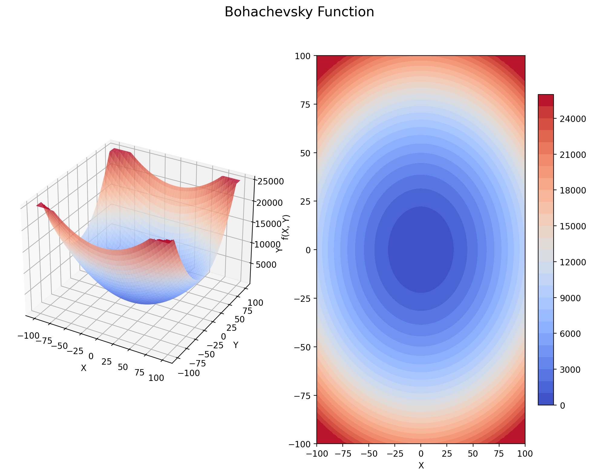
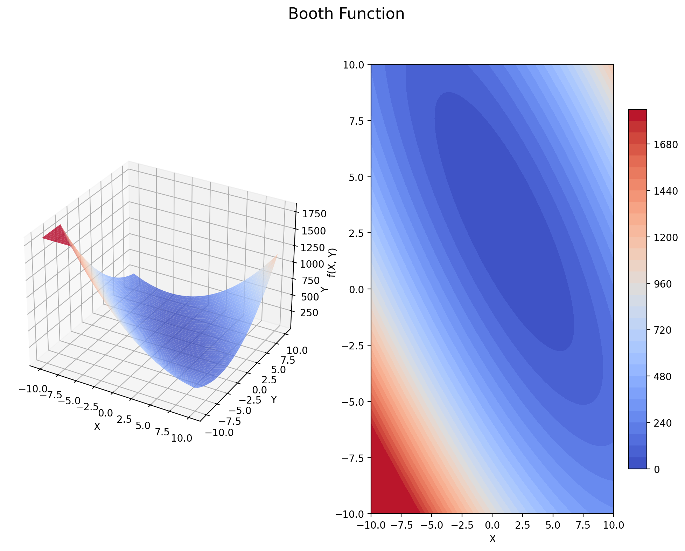
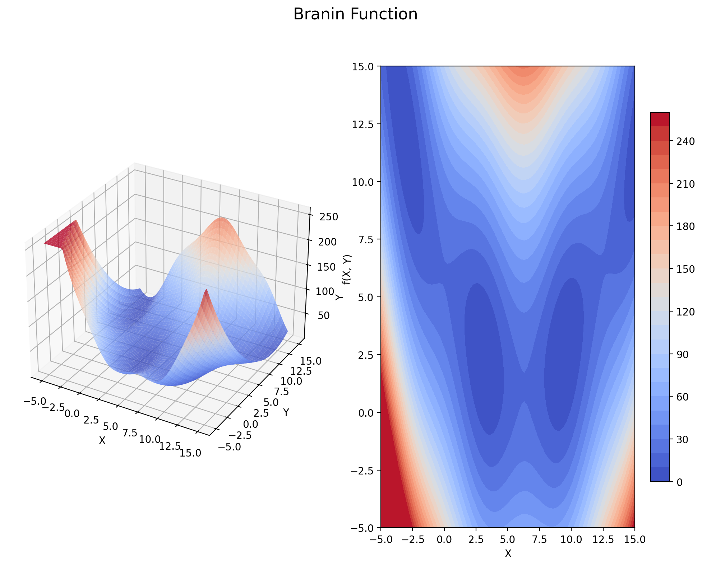

# Optimization Benchmark Functions

This package contains a comprehensive collection of benchmark test functions commonly used to evaluate and compare optimization algorithms.

## Overview

Benchmark functions are essential tools for testing optimization algorithms. These functions provide well-known landscapes with specific characteristics (multiple local minima, steep ridges, flat valleys, etc.) that can challenge different aspects of an optimization algorithm.

## Installation

No special installation required. Just make sure you have NumPy installed:

```bash
pip install numpy
```

Matplotlib is required for visualizing graphs:

```bash
pip install matplotlib
```

## Usage

You can import and use the functions directly:

```python
import numpy as np
from OptimizationBenchmarks.many_local_minima import ackley, rastrigin
from OptimizationBenchmarks.bowl_shaped import sphere
from OptimizationBenchmarks.valley_shaped import rosenbrock

# Create a test point
x = np.array([0.5, -0.2])

# Evaluate different functions
print(f"Sphere function at point {x}: {sphere(x)}")
print(f"Ackley function at point {x}: {ackley(x)}")
print(f"Rastrigin function at point {x}: {rastrigin(x)}")
print(f"Rosenbrock function at point {x}: {rosenbrock(x)}")
```

Or you can import the entire package:

```python
import numpy as np
import OptimizationBenchmarks as opt

# Create a test point
x = np.array([0.5, -0.2])

# Evaluate different functions
print(f"Sphere function at point {x}: {opt.sphere(x)}")
print(f"Ackley function at point {x}: {opt.ackley(x)}")
```

## Function Categories

Functions are categorized according to their characteristics:

### 1. Functions with Many Local Minima

These functions have many local minima, creating a challenge for algorithms. This type of function is used to test the algorithm's tendency to get stuck in local minima.

#### Ackley Function


#### Rastrigin Function


#### Schwefel Function


Other functions: Bukin N.6, Cross-in-Tray, Drop-Wave, Eggholder, Gramacy & Lee, Griewank, Holder Table, Langermann, Levy, Levy N.13, Schaffer N.2, Schaffer N.4, Shubert

### 2. Bowl-Shaped Functions

These functions have a single minimum surrounded by circular or elliptical contours.

#### Sphere Function


#### Bohachevsky Function


Other functions: Perm Function 0, Rotated Hyper-Ellipsoid, Sum of Different Powers, Sum Squares, Trid

### 3. Plate-Shaped Functions

These functions have flat regions that can challenge the algorithm's ability to determine the correct direction.

#### Booth Function


#### Matyas Function


Other functions: McCormick, Power Sum, Zakharov

### 4. Valley-Shaped Functions

These functions have long, narrow valleys that can slow down the convergence of many algorithms.

#### Rosenbrock Function (Banana Function)


#### Six-Hump Camel Function


Other functions: Three-Hump Camel, Dixon-Price

### 5. Functions with Steep Ridges/Drops

These functions have steep ridges or drops that can challenge gradient-based methods.

#### Easom Function


#### Michalewicz Function


Other functions: De Jong N.5

### 6. Other Functions

Other functions with various characteristics.

#### Beale Function


#### Branin Function


Other functions: Colville, Forrester, Goldstein-Price, Hartmann 3D/4D/6D, Perm Function d, Powell, Shekel, Styblinski-Tang

## Function Documentation

Each function includes comprehensive documentation:
- Mathematical formula
- Global minimum value and location
- Recommended search bounds
- Dimensionality requirements

For example:

```python
def ackley(x):
    """
    Ackley Function
    
    f(x) = -20*exp(-0.2*sqrt(1/n*sum(x_i^2))) - exp(1/n*sum(cos(2*pi*x_i))) + 20 + e
    
    Global minimum: f(0,...,0) = 0
    Bounds: [-32.768, 32.768]
    
    Parameters:
        x (array): Input vector
    
    Returns:
        float: Function value at point x
    """
```

## Example: Testing an Optimization Algorithm

Here's a simple example of testing an optimization algorithm using these benchmark functions:

```python
import numpy as np
from OptimizationBenchmarks.many_local_minima import ackley
from OptimizationBenchmarks.bowl_shaped import sphere

def simple_gradient_descent(func, starting_point, lr=0.01, max_iter=1000, epsilon=1e-6):
    """A simple gradient descent optimizer"""
    x = np.array(starting_point, dtype=float)
    
    for i in range(max_iter):
        # Calculate numerical gradient
        grad = np.zeros_like(x)
        for j in range(len(x)):
            h = np.zeros_like(x)
            h[j] = epsilon
            grad[j] = (func(x + h) - func(x - h)) / (2 * epsilon)
        
        # Update step
        x_new = x - lr * grad
        
        # Check convergence
        if np.linalg.norm(x - x_new) < epsilon:
            break
            
        x = x_new
        
    return x, func(x)

# Test optimization on different functions
dim = 2
starting = np.random.uniform(-1, 1, dim)

# Test on Sphere function
result_x, result_f = simple_gradient_descent(sphere, starting)
print(f"Sphere function optimization result: {result_x}, value: {result_f}")

# Test on Ackley function
result_x, result_f = simple_gradient_descent(ackley, starting)
print(f"Ackley function optimization result: {result_x}, value: {result_f}")
```

## Visualizing All Functions

To visualize all 2D benchmark functions, you can run the `plot_all_functions.py` script:

```bash
python plot_all_functions.py
```

This script will plot all 2D functions and save them to the `graphs` folder. Each visualization includes a 3D surface plot and a contour plot.

## Contributing

List of the above functions are imported from https://www.sfu.ca/~ssurjano/optimization.html

You can contribute by adding new benchmark functions, improving existing implementations, or fixing bugs. 